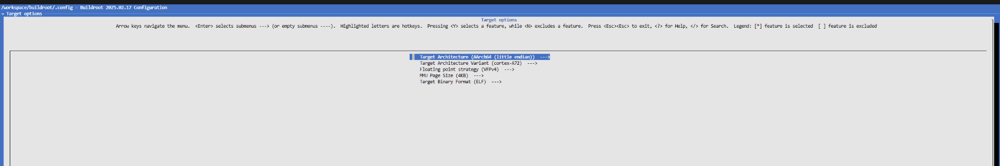
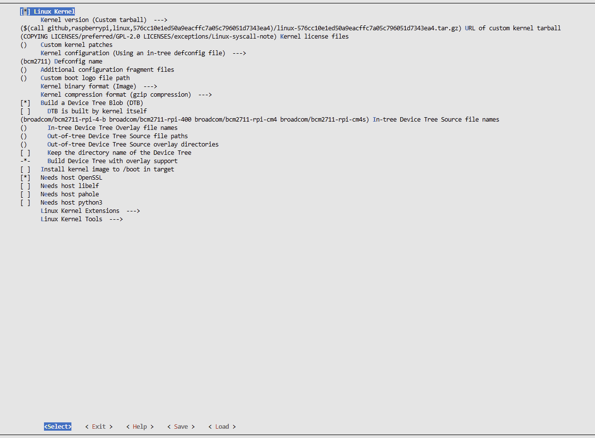
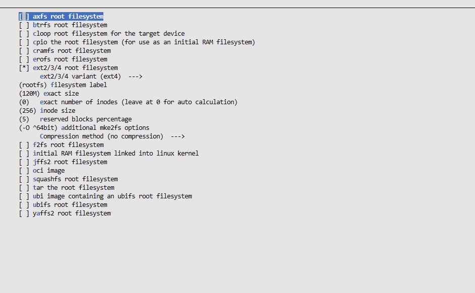

# Lab 01 — Initial Setup

## Goal

Before we even start, let's mark down the goal of this lab. Which is to prepare the development environment used throughout the course and to become familiar with the tools used to build and inspect an embedded Linux system in our case the Raspberry Pi 4.

## Part 1 — Development environment

### Git and lab journal repository

The course starts by asking us to use Git to manage the journals written for the different labs.

Hence, I first created a public GitHub repository called `ma-ses-labs` and cloned it locally using Visual Studio Code.

I then checked the state of the repository with:
```
git status
```

The repository was on the `main` branch and was correctly synchronized with the remote repository.

I also checked the configured remote with:

```
git remote -v
```

This confirmed that the local repository was connected to my GitHub repository through the remote called `origin`.

I checked my Git identity using:

```
git config --global user.name
git config --global user.email
```
Since I am working on Windows, I also applied the configuration requested in the lab:

```
git config --global core.autocrlf false
```

This is used in order to avoids Git automatically converting line endings between Windows and Linux, which could create unnecessary differences in files that will also be used inside the Linux development container. I then created the first journal file under:

`lab-01-initial-setup/journal.md`

and committed it to Git so that the journal itself is versioned while I progress through the lab.

---

### Docker and Visual Studio Code Dev Containers

The course uses Docker to provide a Linux development environment independent of the host operating system. This is useful in my case because my host system is Windows, while most of the tools used in the labs are Linux tools. I checked that Docker and Docker Compose were already installed with:

```
docker --version
docker compose version
```

The installed versions were:

- Docker version 29.4.3
- Docker Compose version v5.1.3

The course also uses the "Dev Containers" extension for Visual Studio Code which luckily I had already installed. A Dev Container allows Visual Studio Code to work directly inside a Docker container. In practice, this means that I can use the Linux development environment prepared for the course without having to install and configure all of its tools directly on Windows.

---

### Course resources and development container

The resources required for the labs were provided in the following Git repository:

`https://github.com/MA-SeS/resources`

Which I cloned  separately from my journal repository.

After inspecting its contents, I found the `labs` directory, which contains a `.devcontainer` directory. The `.devcontainer` directory contains the configuration used by Visual Studio Code to create and start the course development container. I hence opened the `resources/labs` directory in Visual Studio Code and selected "Reopen in Container". After the container had started, the terminal was no longer a Windows PowerShell terminal. Instead, I was working inside the Linux container under:

`/workspace`

Running:

```
ls
```
showed:

- `buildroot`
- `resources`

This confirmed that the development environment had been created correctly and that Buildroot was available under:

`/workspace/buildroot`

I also checked the Git branch used by this Buildroot installation with:
```
`git -C /workspace/buildroot branch`
```

The result was:

- `local-lts` (current branch)
- `master`

The `local-lts` branch is created by the course environment so that changes made during the labs can be tracked separately from the original Buildroot source.

---

## Part 2 — Generate a vanilla SD card image

### Choosing the Raspberry Pi 4 Buildroot configuration

Buildroot provides predefined configurations, called "defconfigs", for many target boards. A defconfig is basically a starting configuration containing the important settings needed for a particular platform. This avoids having to configure every Buildroot option manually. I listed the available Raspberry Pi 4 configurations with:
```
make list-defconfigs | grep -i raspberrypi4
```

The result was:

- `raspberrypi4_64_defconfig` — Build for raspberrypi4_64
- `raspberrypi4_defconfig` — Build for raspberrypi4

There are therefore two configurations available for the Raspberry Pi 4: a 32-bit version and a 64-bit version. The Raspberry Pi 4 used in the course has a 64-bit ARM Cortex-A72 processor, so I chose the 64-bit configuration. I then loaded it with:

```
`make raspberrypi4_64_defconfig`
```

Buildroot then generated its current complete configuration in the `.config` file.

I verified that the file had been created with:

```
ls -la .config
```
---

### Inspecting the configuration with `menuconfig`

To inspect the loaded configuration, I opened Buildroot's configuration interface with:

```
make menuconfig
```

`menuconfig` provides a text-based interface for browsing and modifying the Buildroot configuration.

The goal here was not to modify anything yet, but to verify that the selected defconfig really corresponds to the Raspberry Pi 4 instead of only trusting its filename.

In the `Target options` menu, I found:

- Target Architecture: `AArch64`
- Target Architecture Variant: `cortex-A72`



This gave me strong confidence that the configuration was correct.

`AArch64` corresponds to the 64-bit ARM architecture, while `Cortex-A72` is the CPU core used by the Raspberry Pi 4 in the course (Introduction slides).

I then also inspected the `Linux Kernel` configuration. Among the Device Tree files configured for the kernel, I found several entries based on `bcm2711`, including Raspberry Pi 4 variants.



A `Device Tree` is a description of the hardware that is passed to the Linux kernel. It is especially useful on embedded systems because some hardware cannot simply be detected automatically by software. The Raspberry Pi 4 uses the BCM2711 SoC, so seeing these `bcm2711` Device Tree entries was another indication that the selected configuration corresponds to the correct board.

I also briefly explored some of the other Buildroot menus to get an idea of what can be configured. For example, the `Target packages` menu contains the software and libraries that can be included in the final embedded Linux system. In the `Filesystem images` menu, I noticed that an `ext2/3/4` root filesystem image is enabled and currently configured with a size of 120 MB.



The `root filesystem`, often abbreviated as `rootfs`, is the filesystem mounted at `/` when Linux starts. It contains the programs, libraries, configuration files and other files needed by the user-space part of the system.

At this point I did not modify any of these settings. The purpose of this step was only to inspect the predefined configuration and understand why it matches the Raspberry Pi 4. After exiting `menuconfig`, I ran:

`git status`

The Buildroot repository was still clean. Which surprised me at first but is expected because generated files such as `.config` and files inside the build output directories are not tracked as normal source changes in the Buildroot Git repository.