# Lab 01 — Initial Setup

## Introduction

This laboratory was carried out between the 24th and 26th of September 2026 as part of the MA_SeS - Secure Embedded Systems course. It was performed by Alexandre Schmid.

The main objective of this lab was to prepare the development environment used throughout the course and to discover the different components involved in building an embedded Linux system for a Raspberry Pi 4. The work progressively covered the configuration of Buildroot, the generation and inspection of a bootable SD card image, the customization of the generated Linux system, and finally the integration of U-Boot into the boot process.

This laboratory therefore provided a first practical introduction to embedded Linux concepts such as cross-compilation, kernels, root filesystems, Device Trees, disk images and bootloaders.

---

## Methodology

The laboratory was carried out in several successive steps, allowing the development environment and the embedded Linux system to be explored progressively.

First, the Git repository used for the lab journals was prepared, and the course development environment was opened through a Visual Studio Code Dev Container. This provided a Linux environment containing the Buildroot sources and all the tools required for the exercises.

In a second step, the predefined `raspberrypi4_64_defconfig` was loaded and inspected using `menuconfig`. The architecture, processor variant, kernel configuration and filesystem options were checked in order to verify that the selected configuration actually corresponded to the Raspberry Pi 4.

A first complete image was then built with Buildroot. The generated files and Buildroot directories were inspected in order to better understand the build process, including the downloaded sources, compiled packages and cross-compilation toolchain. The resulting `sdcard.img` was also analyzed with `fdisk`, and its boot and root filesystem partitions were mounted directly in the development environment to inspect their contents.

The generated image was then flashed onto a physical microSD card. The runtime validation could not yet be completed because the USB-to-UART adapter required for the serial console was not available with the hardware kit.

Finally, a custom Buildroot configuration was created from the original Raspberry Pi configuration. The hostname, login banner and root password were modified and verified directly inside the generated root filesystem. U-Boot was then enabled and integrated into the boot process by configuring the correct Raspberry Pi 4 U-Boot defconfig and modifying the boot image configuration. The final image was inspected offline to verify that both U-Boot and the Linux kernel were correctly present and that the Raspberry Pi firmware was configured to load U-Boot first.

---

## Part 1 — Development environment

### Git and lab journal repository

The course starts by asking us to use Git to manage the journals written for the different labs.

Hence, I first created a public GitHub repository called `ma-ses-labs` and cloned it locally using Visual Studio Code.

I then checked the state of the repository with:
```
git status
```

The repository was on the `main` branch and was correctly synchronized with the remote repository.

I also checked the configured remote with:

```
git remote -v
```

This confirmed that the local repository was connected to my GitHub repository through the remote called `origin`.

I checked my Git identity using:

```
git config --global user.name
git config --global user.email
```
Since I am working on Windows, I also applied the configuration requested in the lab:

```
git config --global core.autocrlf false
```

This is used in order to avoids Git automatically converting line endings between Windows and Linux, which could create unnecessary differences in files that will also be used inside the Linux development container. I then created the first journal file under:

`lab-01-initial-setup/journal.md`

and committed it to Git so that the journal itself is versioned while I progress through the lab.

---

### Docker and Visual Studio Code Dev Containers

The course uses Docker to provide a Linux development environment independent of the host operating system. This is useful in my case because my host system is Windows, while most of the tools used in the labs are Linux tools. I checked that Docker and Docker Compose were already installed with:

```
docker --version
docker compose version
```

The installed versions were:

- Docker version 29.4.3
- Docker Compose version v5.1.3

The course also uses the "Dev Containers" extension for Visual Studio Code which luckily I had already installed. A Dev Container allows Visual Studio Code to work directly inside a Docker container. In practice, this means that I can use the Linux development environment prepared for the course without having to install and configure all of its tools directly on Windows.

---

### Course resources and development container

The resources required for the labs were provided in the following Git repository:

`https://github.com/MA-SeS/resources`

Which I cloned  separately from my journal repository.

After inspecting its contents, I found the `labs` directory, which contains a `.devcontainer` directory. The `.devcontainer` directory contains the configuration used by Visual Studio Code to create and start the course development container. I hence opened the `resources/labs` directory in Visual Studio Code and selected "Reopen in Container". After the container had started, the terminal was no longer a Windows PowerShell terminal. Instead, I was working inside the Linux container under:

`/workspace`

Running:

```
ls
```
showed:

- `buildroot`
- `resources`

This confirmed that the development environment had been created correctly and that Buildroot was available under:

`/workspace/buildroot`

I also checked the Git branch used by this Buildroot installation with:
```
`git -C /workspace/buildroot branch`
```

The result was:

- `local-lts` (current branch)
- `master`

The `local-lts` branch is created by the course environment so that changes made during the labs can be tracked separately from the original Buildroot source.

---

## Part 2 — Generate a vanilla SD card image

### Choosing the Raspberry Pi 4 Buildroot configuration

Buildroot provides predefined configurations, called "defconfigs", for many target boards. A defconfig is basically a starting configuration containing the important settings needed for a particular platform. This avoids having to configure every Buildroot option manually. I listed the available Raspberry Pi 4 configurations with:
```
make list-defconfigs | grep -i raspberrypi4
```

The result was:

- `raspberrypi4_64_defconfig` — Build for raspberrypi4_64
- `raspberrypi4_defconfig` — Build for raspberrypi4

There are therefore two configurations available for the Raspberry Pi 4: a 32-bit version and a 64-bit version. The Raspberry Pi 4 used in the course has a 64-bit ARM Cortex-A72 processor, so I chose the 64-bit configuration. I then loaded it with:

```
`make raspberrypi4_64_defconfig`
```

Buildroot then generated its current complete configuration in the `.config` file.

I verified that the file had been created with:

```
ls -la .config
```
---

### Inspecting the configuration with `menuconfig`

To inspect the loaded configuration, I opened Buildroot's configuration interface with:

```
make menuconfig
```

`menuconfig` provides a text-based interface for browsing and modifying the Buildroot configuration.

The goal here was not to modify anything yet, but to verify that the selected defconfig really corresponds to the Raspberry Pi 4 instead of only trusting its filename.

In the `Target options` menu, I found:

- Target Architecture: `AArch64`
- Target Architecture Variant: `cortex-A72`


This gave me strong confidence that the configuration was correct.

`AArch64` corresponds to the 64-bit ARM architecture, while `Cortex-A72` is the CPU core used by the Raspberry Pi 4 in the course (Introduction slides).

I then also inspected the `Linux Kernel` configuration. Among the Device Tree files configured for the kernel, I found several entries based on `bcm2711`, including Raspberry Pi 4 variants.


A `Device Tree` is a description of the hardware that is passed to the Linux kernel. It is especially useful on embedded systems because some hardware cannot simply be detected automatically by software. The Raspberry Pi 4 uses the BCM2711 SoC, so seeing these `bcm2711` Device Tree entries was another indication that the selected configuration corresponds to the correct board.

I also briefly explored some of the other Buildroot menus to get an idea of what can be configured. For example, the `Target packages` menu contains the software and libraries that can be included in the final embedded Linux system. In the `Filesystem images` menu, I noticed that an `ext2/3/4` root filesystem image is enabled and currently configured with a size of 120 MB.


The `root filesystem`, often abbreviated as `rootfs`, is the filesystem mounted at `/` when Linux starts. It contains the programs, libraries, configuration files and other files needed by the user-space part of the system.

At this point I did not modify any of these settings. The purpose of this step was only to inspect the predefined configuration and understand why it matches the Raspberry Pi 4. After exiting `menuconfig`, I ran:

`git status`

The Buildroot repository was still clean. Which surprised me at first but is expected because generated files such as `.config` and files inside the build output directories are not tracked as normal source changes in the Buildroot Git repository.

### Building the vanilla SD card image

After checking the Raspberry Pi 4 configuration, I started the very very long and complete Buildroot build. Since the container exposes 16 CPU threads, I used:

```
make -j$(nproc)
```

The `-j` option allows `make` to run several compilation jobs in parallel, which is useful because a complete Buildroot build involves compiling many many many different components. The first build stopped as expected almost immediately during Buildroot's dependency checks. The error indicated that the `install` command provided by Ubuntu 26.04 came from `uutils` and was affected by a known compatibility issue. Buildroot suggested switching to the GNU implementation:

```
sudo update-alternatives --install /usr/bin/install install /usr/bin/gnuinstall 100
```

After applying this change, I once again restarted the build. This was useful because it showed that Buildroot checks the development machine before compiling anything. Even if the target system is a Raspberry Pi, the tools running on the host also need to behave in a way Buildroot expects. The complete build then took as said before significantly longer, since Buildroot had to download, configure and compile all the components required for the target system.

---

### Understanding the Buildroot output

Once the build was finally finished, I inspected the directories used during the build. Downloaded source packages are stored in:

`dl/`

Extracted source trees and compiled packages are stored in:

`output/build/`

Tools that run on the development machine on the other hand are stored in:

`output/host/`

This includes the cross-compilation toolchain. For example, in `output/host/bin` I found tools such as:

`aarch64-buildroot-linux-gnu-gcc`

`aarch64-buildroot-linux-gnu-ld`

`aarch64-buildroot-linux-gnu-as`

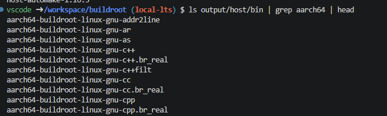

The `aarch64` prefix confirms that these tools generate code for the 64-bit ARM architecture used by the Raspberry Pi, even though the compiler itself runs inside the development container. This illustrates well the concept of cross-compilation.

---

### Generated images

The most important generated files were located under:

`output/images/`

Among them were:

- `Image` — the Linux kernel image
- several `bcm2711-*.dtb` files — Device Tree files for BCM2711-based Raspberry Pi boards
- `boot.vfat` — the boot filesystem image
- `rootfs.ext2` / `rootfs.ext4` — the root filesystem image
- `sdcard.img` — the complete SD card image

I used the `file` command to inspect some of these files instead of relying only on their filenames.

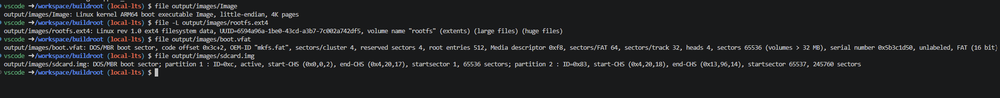

The results showed that:

- `Image` is an ARM64 Linux kernel image
- `boot.vfat` contains a FAT filesystem
- the root filesystem is actually an ext4 filesystem
- `sdcard.img` is a complete disk image containing an MBR partition table

One interesting detail was that `rootfs.ext4` is a symbolic link to `rootfs.ext2`, whilst inspecting the image itself had showed that the filesystem is ext4.  The final `sdcard.img` is therefore not just a filesystem. It represents the full SD card, including its partition table and the different filesystems that will be placed on it.

---

### Inspecting the SD card partition table

I then inspected the generated SD card image with:
```
`fdisk -l output/images/sdcard.img`
```

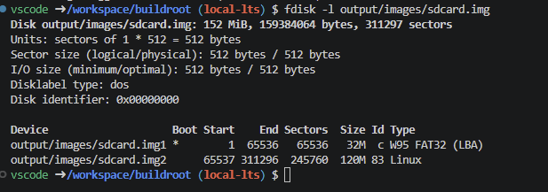

The image uses sectors of 512 bytes and contains two partitions.

The first partition contains 65536 sectors and starts at sector 1:

```
offset = 1 x 512 = 512 bytes

size = 65536 x 512 = 33'554'432 bytes = 32 MiB
```

The second partition on the other hand starts at sector 65537 and contains 245760 sectors:

```
offset = 65537 x 512 = 33'554'944 bytes

size = 245760 x 512 = 125'829'120 bytes = 120 MiB
```

The first partition is therefore the small boot partition, while the second partition contains the much larger Linux root filesystem. Doing the calculation manually was indeed necessary because the `mount` command needs the partition offset in bytes, while `fdisk` reports the start position in sectors.

---

### Mounting and inspecting the partitions

Furthermore, to inspect the filesystems without flashing the image to an SD card, I mounted both partitions directly from `sdcard.img`. I mounted them read-only to avoid accidentally modifying the generated image.

The first partition was mounted as:

`vfat`

while the second partition was mounted as:

`ext4`

This confirmed that the disk image contains two different filesystems with different purposes. The boot partition contained files such as:

- `Image`
- `bcm2711-rpi-4-b.dtb`
- `config.txt`
- `cmdline.txt`
- `start4.elf`
- `fixup4.dat`
- `overlays/`

The `Image` file is the Linux kernel, while the `.dtb` files describe the hardware to the kernel. The Raspberry Pi firmware files and configuration are also stored in this partition because they are needed before the Linux root filesystem is available.

-> Source: `05_Boot.pdf`, slides 11–12

---

### Boot configuration

I then inspected both files `cmdline.txt` and `config.txt`.

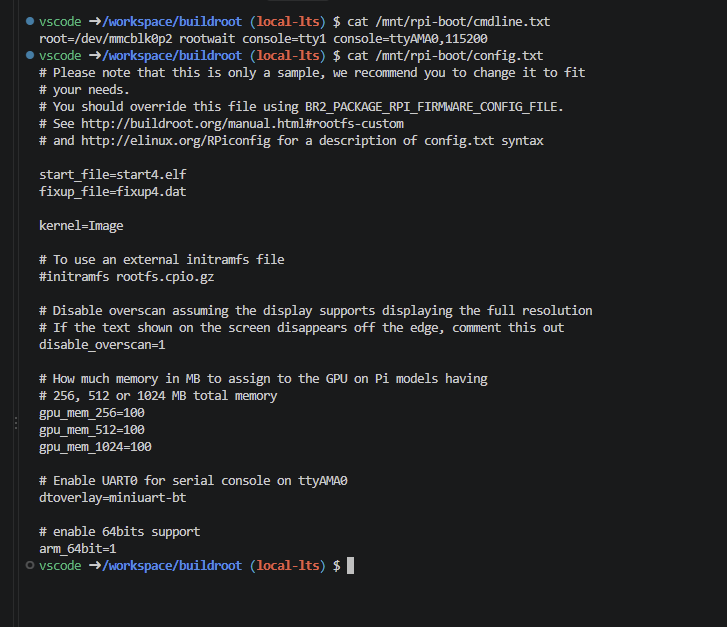

The kernel command line contains:

`root=/dev/mmcblk0p2`

This tells the Linux kernel that its root filesystem is located on partition 2 of the SD card, which matches the partition layout observed with `fdisk`.

It also contains:

`console=ttyAMA0,115200`

which configures a serial console at 115200 baud. This will later allow interaction with the Raspberry Pi through the serial connection used in the lab.

The `config.txt` file contains:

`kernel=Image`

This means that the Raspberry Pi firmware currently loads the Linux kernel image directly.

It also contains:

`arm_64bit=1`

which is consistent with the 64-bit Raspberry Pi configuration selected earlier. The `kernel=Image` setting seems particularly interesting because it shows exactly where the boot process can later be changed.

-> Source: `07-Linux_kernel_and_rootfs.pdf`, slide 16
-> Source: `05_Boot.pdf`, slides 11–12

---

### Inspecting the root filesystem

The second partition contained the expected Linux root filesystem structure:

- `/bin`
- `/dev`
- `/etc`
- `/lib`
- `/proc`
- `/root`
- `/sbin`
- `/sys`
- `/usr`
- `/var`

This made the root filesystem concept much more concrete than simply seeing `rootfs.ext4` as an image file.

The `/etc` directory already contained configuration files such as:

- `hostname`
- `passwd`
- `shadow`
- `fstab`
- `inittab`
- `os-release`
- network configuration files

I also found the BusyBox executable under `/bin/busybox`, with a size of about 803 KB. BusyBox provides many common Unix commands through a single compact executable, which is useful in an embedded Linux system where keeping the root filesystem small is important. Directories such as `/proc`, `/sys` and `/dev` are already present as mount points in the root filesystem, but some of their contents will only be created dynamically by the kernel when Linux is running.

-> Source: `07-Linux_kernel_and_rootfs.pdf`, slides 29–37

At this stage, the vanilla Buildroot image had been successfully generated and its main components, partition layout, boot files and root filesystem had been inspected.

---

### Flashing the SD card

After inspecting the generated image, I copied `sdcard.img` to the host system and flashed it to the physical microSD card using balenaEtcher.

The first flashing attempt failed because the writer process stopped unexpectedly. I therefore cleared the SD card partition table and retried the operation, after which the image was written successfully.

At this point, the generated Linux system was ready on the physical SD card.

---

### Temporary hardware limitation

The next step of the lab unfortunately requires a USB-to-UART serial adapter in order to connect the Raspberry Pi to the host computer and observe the kernel boot logs.

Following discussions with M. Haab and M. Mäder on 24.09.2026, the adapter was not yet available with my hardware kit, so I could not perform this serial connection or validate the system by booting the Raspberry Pi at this stage.

I therefore stopped Part 2 after successfully flashing the SD card. The remaining validation steps will be completed once the serial adapter is available.


---

## Part 3 — Custom Buildroot configuration and U-Boot

### Creating my own Buildroot configuration

Until now I had been using the predefined `raspberrypi4_64_defconfig` provided by Buildroot. For the rest of the lab, I had to created my own configuration based on it: `alexandre_rpi4_64_defconfig`

I first copied the original Raspberry Pi 4 configuration:

```
cp configs/raspberrypi4_64_defconfig configs/alexandre_rpi4_64_defconfig
```

and then loaded my new configuration with:

```
make alexandre_rpi4_64_defconfig
```

In `menuconfig`, under "Build options", I then changed  "Location to save buildroot config" to: `/workspace/buildroot/configs/alexandre_rpi4_64_defconfig`

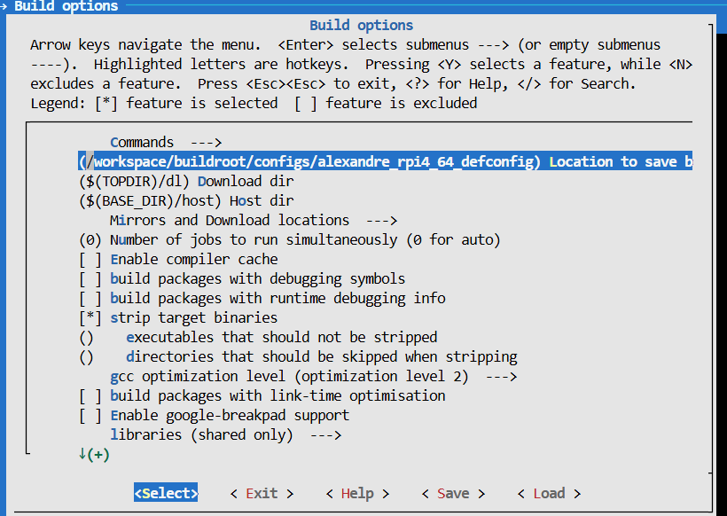

This means that after modifying the active `.config`, I can use:

```
make savedefconfig
```

to update my own compact defconfig instead of modifying the original Raspberry Pi configuration. This separation is important because it keeps the original Buildroot board configuration untouched while allowing my own choices to be reproduced later.

---

### Custom hostname, banner and root password

I then used the "System configuration" menu to personalize the generated Linux system.

I changed the hostname from the default `buildroot` value to: `alexandre-rpi4`

and the system banner to: `Welcome to my super MA_SeS Raspberry Pi 4 !!!`

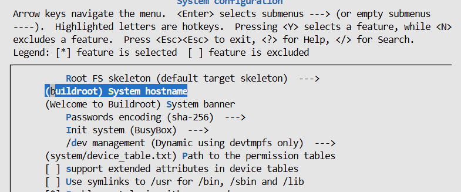

The default Buildroot image also allows the `root` user to log in without a password, which is very obviously not desirable for a real system. I therefore enabled: `Enable root login with password` and configured a root password using the: `Root password` option.

Finally, I then saved the configuration with:

```
make savedefconfig
```

and verified that my defconfig contained the expected hostname and banner. I also checked that a root password was configured without displaying the password itself

After rebuilding the image, I kept a separate copy named: `sdcard-custom.img` This will allows me to keep the vanilla image and the customized image separately instead of overwriting previous work.

---

### Verifying the customized root filesystem offline

Since the serial adapter was still unavailable at the time, I could not yet validate these changes by logging into the Raspberry Pi.

However, I could still inspect the generated filesystem directly. Hence, I mounted `rootfs.ext4` read-only using a loop device and checked the relevant files inside the generated image.

The results were:

- `/etc/hostname` contained `alexandre-rpi4`
- `/etc/issue` contained my custom banner
- `/etc/shadow` contained a password hash for the `root` account

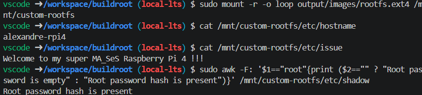

This was useful because it verifies the contents of the actual generated filesystem rather than only checking the Buildroot configuration. It does not completely replace testing the running system, but it gives good confidence here that the custom image was generated as intended.

---

### Adding U-Boot

For this final step, the original Raspberry Pi image uses the Raspberry Pi firmware to load the Linux kernel directly. The goal of now was to insert U-Boot into the boot process, changing it approximately from:

`Raspberry Pi firmware --> Linux kernel`

to:

`Raspberry Pi firmware --> U-Boot`

U-Boot is a bootloader and gives more control over how the operating system is loaded. Later it can be used to load the Linux kernel, Device Tree and boot parameters. I therefore enabled "U-Boot" under the "Bootloaders" section of `menuconfig`. At this point Buildroot also required a board-specific U-Boot defconfig.

Initially, I enabled U-Boot without filling in the "Board defconfig" field and tried to extract the U-Boot sources. Buildroot stopped with:

`No board defconfig name specified`

This showed that Buildroot validates the U-Boot board configuration before continuing with the extraction/build process. The U-Boot archive had already been downloaded, so I inspected its available Raspberry Pi defconfigs directly.

Among the available configurations were:

- `rpi_4_32b_defconfig`
- `rpi_4_acpi_defconfig`
- `rpi_4_defconfig`
- `rpi_arm64_defconfig`

For the 64-bit Raspberry Pi 4 used in this lab, I selected :

`rpi_4_defconfig`

The Buildroot "Board defconfig" field expects the filename without the `_defconfig` suffix, so I configured it as: `rpi_4` and saved the configuration again with :

```
make savedefconfig
```

I verified the resulting setting:

`BR2_TARGET_UBOOT_BOARD_DEFCONFIG="rpi_4"`

After this, `make uboot-extract` completed successfully and the U-Boot source tree was available under: `output/build/uboot-2025.01/`

---

### Changing the Raspberry Pi boot target

The existing Raspberry Pi firmware configuration contained `kernel=Image`. This tells the firmware to load the Linux kernel directly.

To make it load U-Boot instead, I modified `board/raspberrypi/config_4_64bit.txt` and changed `kernel=Image` to `kernel=u-boot.bin`

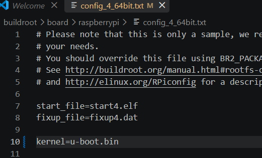

This changes which binary the Raspberry Pi firmware executes first. However, this introduces another issue. Since the firmware configuration now refers to `u-boot.bin`, Buildroot would include U-Boot in the boot filesystem but the Linux `Image` file would no longer automatically be included. The kernel will still be needed later, so I also modified: `board/raspberrypi/genimage.cfg.in`

Inside the boot filesystem `files` section I added: `"Image",`

The two changes therefore have different purposes:

- `config_4_64bit.txt` decides which binary is loaded first by the Raspberry Pi firmware
- `genimage.cfg.in` decides which files are physically included in the boot filesystem

This distinction helped me understand that selecting a bootloader and deciding which files are present on the boot partition are two separate problems.

---

### Rebuilding the image with U-Boot

Because the boot image had already been generated previously, the lab asks us to force its regeneration.

As specified in the lab, I removed `output/images/sdcard.img` and `output/images/boot.vfat` before reinstalling the Raspberry Pi firmware and rebuilding :

```
`make rpi-firmware-reinstall`
`make -j$(nproc)`
```

Removing the already generated images ensures that they are recreated using the new configuration instead of potentially keeping stale versions from the previous build. After the build completed, the `output/images` directory contained a new file  `u-boot.bin` with a size of approximately 678 KB.

<!-- Screenshot: terminal output of "ls -lh output/images" where u-boot.bin appears at the bottom alongside Image, boot.vfat, rootfs.ext2 and sdcard.img -->
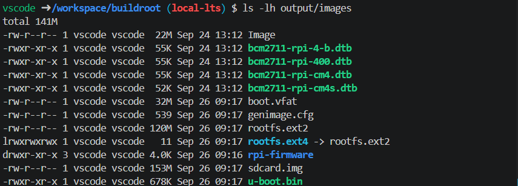

The Linux kernel `Image` was also still present, confirming that the additional entry in `genimage.cfg.in` worked as intended. I kept another copy of the final image as : `sdcard-uboot.img`

At this point I therefore had three separate images:

- `sdcard-vanilla.img`
- `sdcard-custom.img`
- `sdcard-uboot.img`

This makes it possible to return to each stage without rebuilding everything again.

---

### Offline verification of the U-Boot image

Before eventually flashing and when I get the hardware booting the new image, I mounted `boot.vfat` read-only and inspected its contents. The filesystem contained both :

- `Image`
- `u-boot.bin`

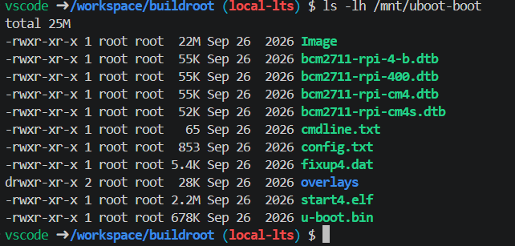

This confirms that U-Boot has been added without losing the Linux kernel. I then checked the generated `config.txt`:

```
grep '^kernel=' /mnt/uboot-boot/config.txt
```

which returned `kernel=u-boot.bin`

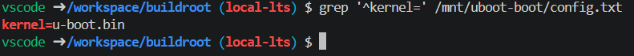

Finally, I inspected the strings contained in the U-Boot binary and found `U-Boot 2025.01`

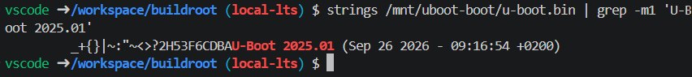

These checks give fairly strong offline evidence that the generated boot filesystem is correctly configured `Raspberry Pi firmware -> u-boot.bin` while the Linux kernel `Image` remains available on the same boot filesystem.

---

### Remaining runtime validation

The final step is to flash the U-Boot image, boot the Raspberry Pi and interrupt the automatic boot process in order to reach the:

`U-Boot>`

prompt.

This validation still requires the USB-to-UART serial adapter, so it could not yet be completed.

The same adapter is also required to complete the missing runtime checks from Part 2.

Once the serial interface is available, I will complete:

- the first boot of the vanilla image
- the running kernel, CPU, RAM and filesystem checks from Part 2
- validation of the custom hostname, banner and root password
- the final U-Boot boot test

## Conclusion

This laboratory allowed me to better understand how an embedded Linux system can be built from its different components using Buildroot. The progressive work, from the initial Raspberry Pi configuration to the inspection of the generated filesystems and finally the integration of U-Boot, was particularly useful to understand what actually happens between the source configuration and the final SD card image.

Some difficulties were encountered, notably with the initial Buildroot dependency issue, the first SD card flashing attempt (most of the difficulty here was to extract the physical SD card), and the U-Boot configuration which required understanding the relationship between the firmware configuration and the files included in the boot partition. The absence of the USB-to-UART adapter also prevented the final runtime validation of the generated images for now.

Despite this limitation, this lab was very instructive and provided a good practical introduction to Buildroot, embedded Linux filesystems, cross-compilation and the boot process of a Raspberry Pi. The remaining serial boot checks will be completed once the required adapter is available.
